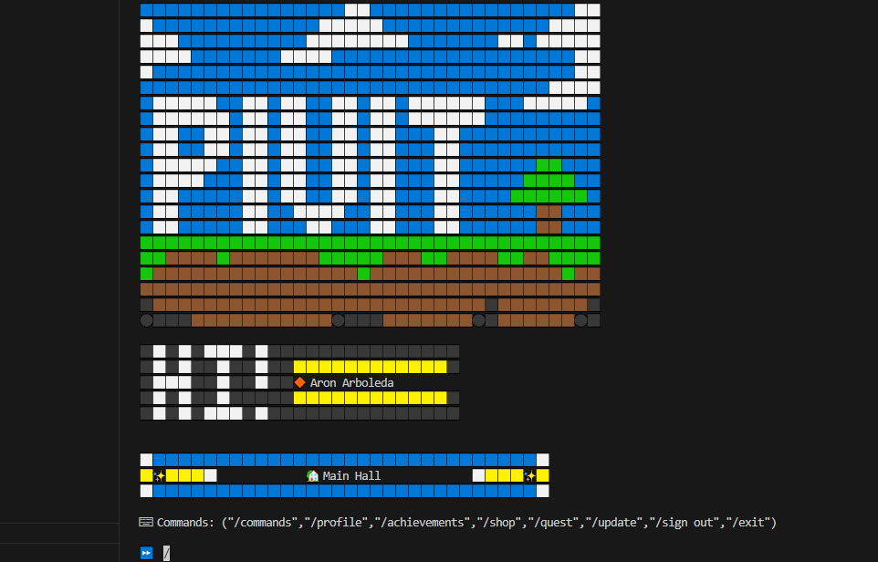
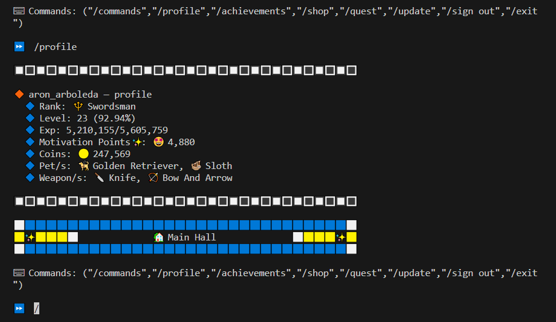
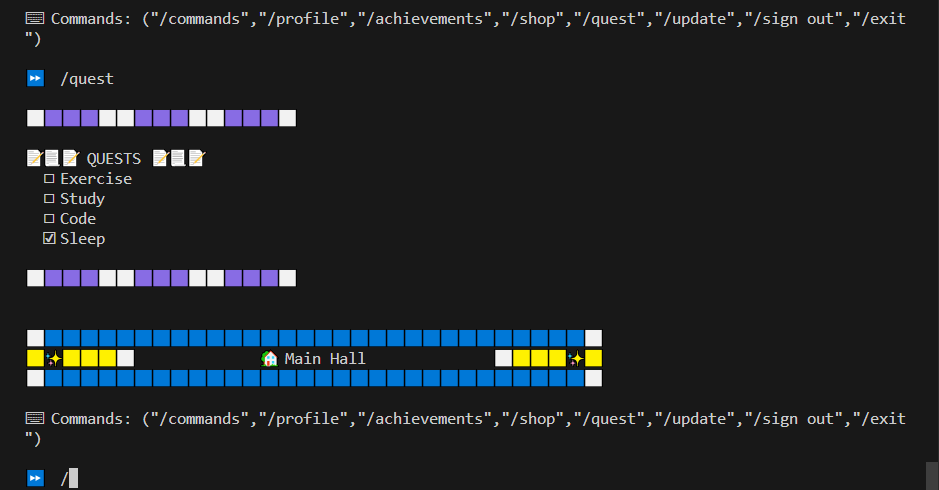
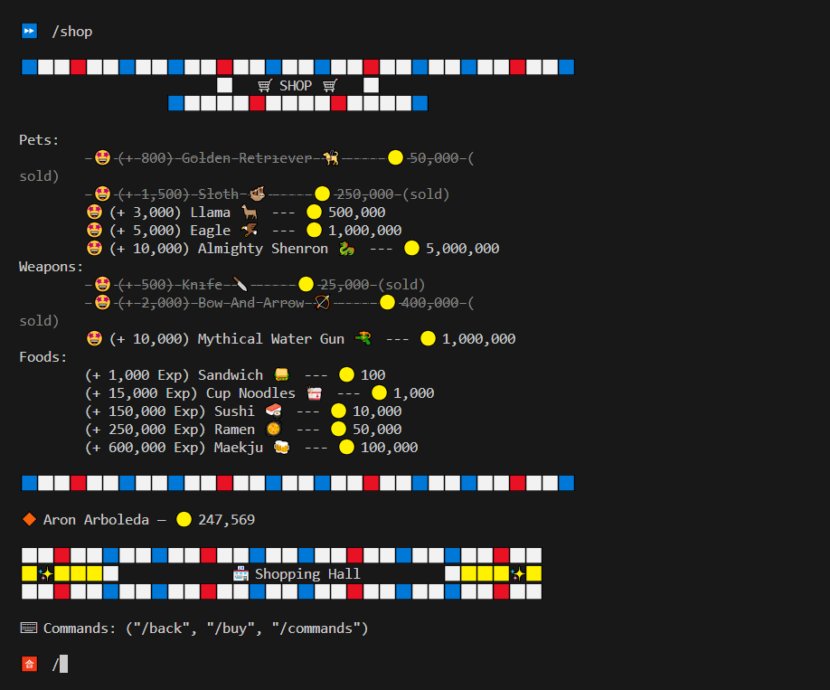
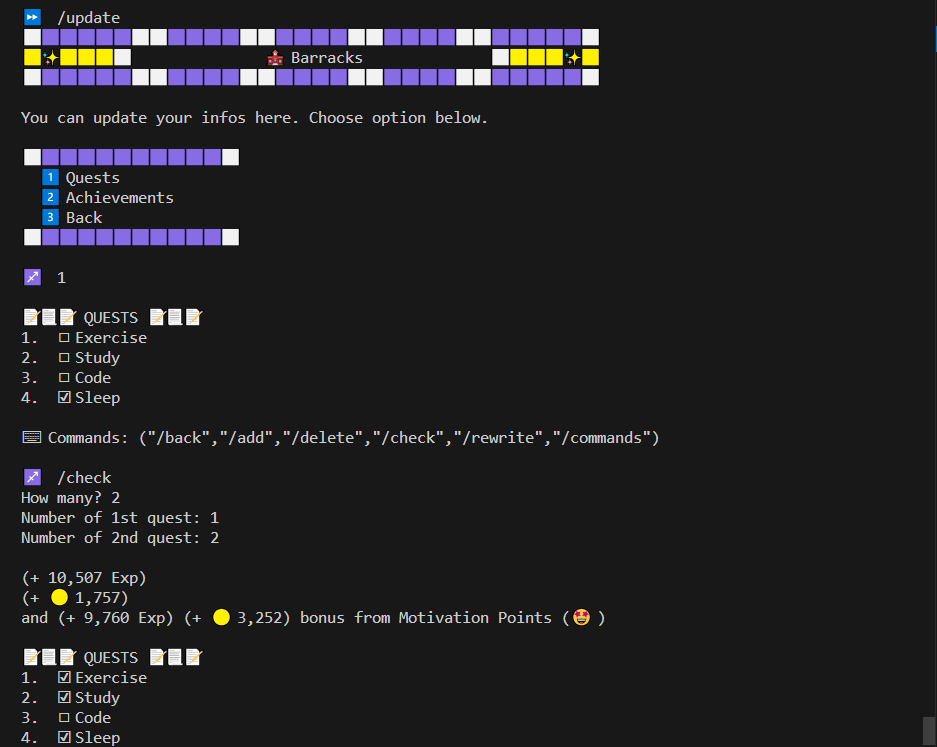

# Pivit

## A python CLI program that can be used to gamify productivity

The program allows users to gamify their productivity by creating to-do lists as daily quests, adding personal achievements to earn coins, leveling up their character profile, and purchasing items at the shop to enhance motivation and engagement in staying productive.

## Features:
* To do lists as quests
* Gamified chievements
* Users can level up with EXP points and upgrade as a character
* Earning coins and exp points are available by completing quests and adding personal achievements
* Shop where you can buy different level of items with coins

## Instructions
### To use the program
* I recommend pulling the repository on your client (vs code as recommended) and running it on the terminal. To properly run on the terminal, first download all the extensions and programs needed to run python files on vs code then find the "Run Python File" somewhere in vs code and run it with that.
### How to use the program
* Making an account is compulsory, add a username and a password and proceed. 
* There are instructions on every level of the command so just do /commands to show them. 
* Explore the program, you can add / update your quests, add achievements, buy items, etc. have fun!

## Program limitations
* Since this is my very first project, it is only a CLI program and doesn't have a user-interface to interact with.
* The user data is only saved on a text files "ProductivityAccounts.txt" & "ProductivityUsersData.txt" and not in any secured databases

## Images
### Profile

### Quests

### Shop

### Updating a Quest
